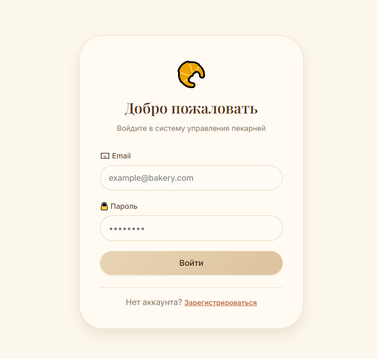
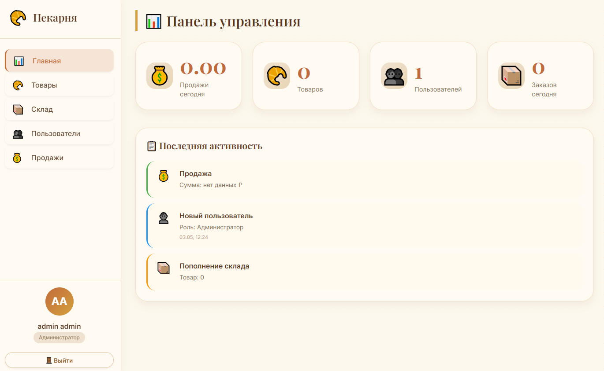
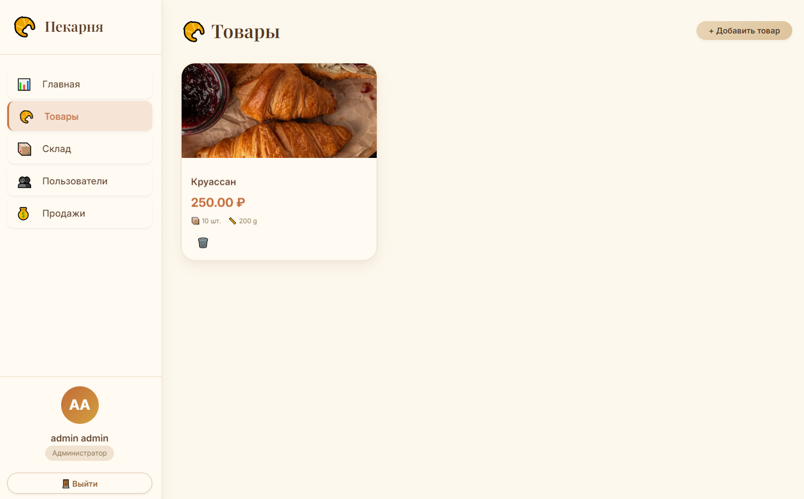
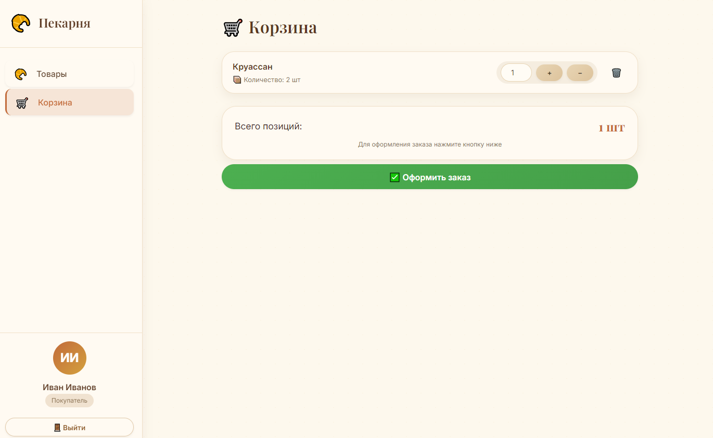
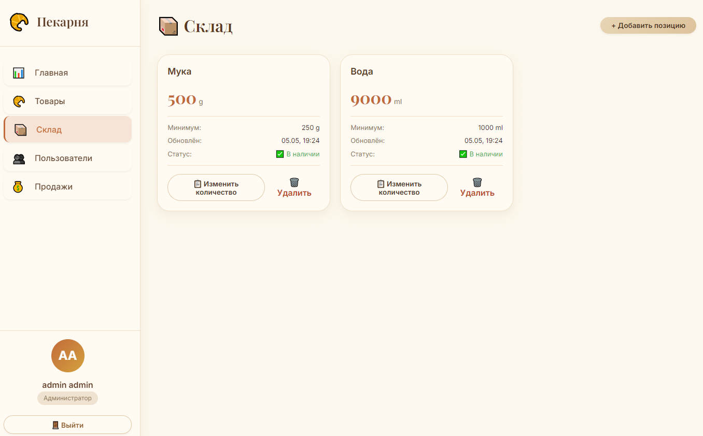
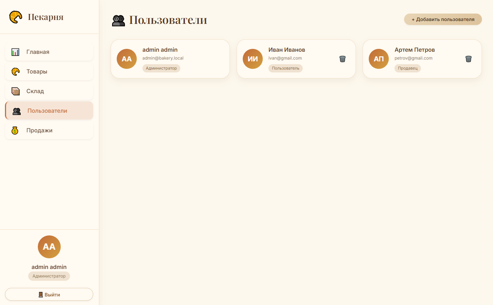

# Bakery Management System

Software for managing a bakery and selling products.

The system automates the core processes: product management, warehouse, users, and sales.

## Table of Contents

- [Introduction](#introduction)
- [Features](#features)
- [Architecture](#architecture)
- [Implementation Details](#implementation-details)
- [Technologies](#technologies)
- [Installation](#installation)
- [Usage](#usage)
- [Limitations and Future Improvements](#limitations-and-future-improvements)
- [License](#license)

## Introduction

Bakery Management System is a client-server application for managing the core business processes of a bakery, including products, warehouse, users, and sales.

The project was originally implemented as a coursework assignment, but was reworked into a fully architecture-separated system with a dedicated C++ backend and a separate Electron client application. The primary focus is on the server-side, which handles business logic, database operations, and exposes a REST API.

The system is built on the principle of separation of concerns: the frontend acts as a UI layer and communicates with the backend via HTTP requests, while all data processing logic resides on the server side.

## Features

### Authentication and Users
- User registration and login
- JWT authentication storing user ID and role
- Role support: `user`, `seller`, `admin`
- Access control based on role
- View current user information
- User management (admin)

### Product Management
- Create and manage product entries
- Upload product images
- Browse product list with summary information
- View detailed product information
- Delete products
- Manage product stock quantities
- Automatic recalculation of raw material costs when creating or updating a product

### Warehouse
- Track warehouse items (raw materials and supplies)
- Restock warehouse inventory
- Write off raw materials
- View current stock levels
- Track the date of last restock

### Cart and Sales Processing
- Add products to cart
- Change product quantities in cart
- Remove products from cart
- View cart contents

- Process a sale via an order (`/orders`)
- Role-based sales logic:
  - **user**: purchase tied to a user account (name, email, etc.)
  - **seller**: offline sale with no user account association
- Automatic stock deduction when a sale is processed
- Sale records saved in the system

### Dashboard
- Retrieve a summary of system activity
- Recent events:
  - sales
  - warehouse restocks
  - new users added

### Dictionaries
- Manage roles and reference entities
- Add and remove manufacturers

## Architecture

The system follows a client-server model with a separated frontend and backend.

### Overview

Frontend (Electron) → REST API → C++ Backend → MS SQL Server

### Frontend

The client is built with Electron and communicates with the server via HTTP requests.

All API interactions are handled through a single module (`api.js`), which:
- encapsulates all requests to the backend
- adds the JWT token to `Authorization` headers
- centralizes error handling
- provides a single base URL (`http://localhost:8080`)

### Backend

The backend is implemented in C++ using the Crow framework and is a monolithic server application.

It is responsible for:
- system business logic
- HTTP request processing
- database operations
- user authentication and authorization

### Architectural Style

The backend follows a layered architecture:

Controller → Service → Data Access Layer (SQL Queries)

- Controllers: accept HTTP requests and perform basic validation
- Services: contain business logic
- Queries layer: handles database interaction

### Database

Microsoft SQL Server is used.

The connection is implemented via an ODBC driver.
All SQL queries are encapsulated in a dedicated `queries` layer.

### Authentication and Security

The system uses JWT authentication.

- The token stores:
  - `userId`
  - `roleId`

- Authorization is verified at the controller level via middleware logic (`fromRequest`)
- Supported roles:
  - `user`
  - `seller`
  - `admin`

User passwords are hashed using PBKDF2 (SHA-256).

### Request Processing Flow

A typical request goes through the following stages:

Frontend → HTTP request → Controller → Service → SQL Queries → Database → Response → Frontend

The controller handles:
- JWT extraction and verification
- basic validation
- passing data to the service layer

## Implementation Details

### Data Management

- A **soft delete** approach is used: records are not physically removed from the database but are marked as deleted (`is_deleted`), preserving history and avoiding data loss.
- Entity uniqueness (e.g., user email or product name) is enforced with soft delete in mind: constraints apply only to active records.

### Authentication and Authorization

- **JWT authentication** is used; the token stores `userId` and `role`, allowing authorization without additional database queries.
- Token verification is performed centrally via utility functions, with the user context subsequently used in controllers.
- A role-based model (`user`, `seller`, `admin`) is implemented with access control per operation.

### Error Handling

- A unified error handling system is implemented using HTTP status codes and error codes (e.g., `VALIDATION_ERROR`, `CONFLICT`, `ENTITY_NOT_FOUND`, etc.).
- Business errors (e.g., duplicate email or insufficient stock) are handled explicitly and returned as the appropriate HTTP responses.
- Unexpected errors (e.g., database driver errors) are logged and returned as `500 Internal Error`.

### Input Validation

- Basic input validation is performed (checking for empty values and correct format).
- Stricter validation (e.g., length limits or value ranges) is partially absent and can be extended.

### Database Access

- **ODBC** is used to connect to Microsoft SQL Server.
- A `queries` layer is used, separating business logic from SQL.
- **Transactions** are used for operations affecting multiple entities (e.g., placing an order and deducting resources).

### Business Logic

- The relationship between products and the warehouse is handled at the logic level:
  - when a product is created or updated, the corresponding raw materials are deducted from the warehouse;
  - when a sale is processed, the product quantity is reduced and resource availability is checked.
- Two sales scenarios are distinguished:
  - `user` — online purchase tied to a user account;
  - `seller` — offline sale with no customer association.

### File Handling

- Product images are uploaded via the API and stored locally on the server.
- The database stores the file path, which is then used by the client.

### Configuration

- Application configuration is managed via environment variables (`.env`):
  - database connection string;
  - JWT signing secret.

### Logging

- Basic logging is implemented for:
  - JWT verification errors;
  - database driver errors (ODBC);
- Logs are printed to the server console.

### Network

- The backend is implemented as a stateless service (no state is stored in memory between requests).
- CORS is supported for client-server communication when running separately.
- The server runs in multithreaded mode using Crow's built-in capabilities.

## Technologies

### Backend
- C++20
- Crow (HTTP server and JSON handling)
- Microsoft SQL Server
- ODBC (database connection)
- jwt-cpp (JWT authentication)
- OpenSSL (password hashing, PBKDF2)
- nlohmann/json (used as a dependency of jwt-cpp)

### Frontend
- Electron
- Node.js
- JavaScript (ES6+)
- Fetch API (backend communication)

### Build and Dependencies
- CMake
- vcpkg
- npm

### Tools
- Git

## Installation

### 1. Clone the Repository

```
git clone --recursive https://github.com/Timofey10012/bakery-management.git
```
```
cd bakery-management
```

The `--recursive` flag is required to fetch vcpkg (included as a submodule).

### 2. Backend (C++)

Requirements:
- CMake 3.21+
- Ninja
- MSVC (C++20 compiler)
- Git
- vcpkg (included as a submodule)

Note: it is recommended to build the backend using
x64 Native Tools Command Prompt for Visual Studio (MSVC toolchain).

Initialize vcpkg (from the project root):

```
cd vcpkg
bootstrap-vcpkg.bat
cd ..
```

Build (from the project root):

```
cmake --preset default
```
```
cmake --build --preset default
```

Run:

```
build\bakery-backend.exe
```

The server starts at http://localhost:8080.

### 3. Database (MSSQL)

Run the file `db/init.sql` using SQL Server Management Studio
or another MSSQL client.

After initialization, a test user is available:
- Email: admin@bakery.local
- Password: admin123

### 4. Frontend (Electron)

Requirements:
- Node.js LTS
- npm

Install and run (from the project root):

```
cd frontend
```
```
npm install
```
```
npm start
```

### 5. Environment Configuration

Set the following environment variables (globally or for the session):
- DB_CONNECTION_STRING — database connection string
- JWT_SECRET — JWT signing secret

An example connection string is provided in `.env.example`.

### 6. Running the Project

After starting both the backend and frontend:
- Backend: http://localhost:8080
- Frontend: Electron application, communicates automatically
  with the backend via REST API

The project is intended for local use. HTTPS and deployment are not configured.
All communication occurs over HTTP + JWT.

### Documentation

`docs/`
Contains the project's API contract in two formats:
- Markdown (`api_contract.md`) — for easy reading
- Excel (`api_contract.xlsx`) — original specification

## Usage

The application is a client-server system with an Electron UI that communicates with the backend via REST API.

Once the system is running, all functionality is accessible through the application's graphical interface.

---

### Authentication

The user authenticates through the login screen:

- register a new account
- log in with email and password
- receive a JWT token

After logging in, the user accesses the main application. Available functionality depends on the user's role.

---

### System Roles

The system supports three roles:

- **user** — customer (purchasing products)
- **seller** — sales staff (offline operations + warehouse management)
- **admin** — system administrator

Roles determine the available actions and UI sections.

---

### User Workflow (user)

Main scenario:

- browse products
- view product details
- add products to cart
- change quantities in cart
- place an order

After placing an order:
- products are deducted from the warehouse
- a sale record is created
- the cart is cleared

---

### Seller Workflow (seller)

The seller uses the same cart interface, but:

- processes offline sales with no user account association
- has access to warehouse operations:
  - restock raw materials
  - write off raw materials

---

### Administration (admin)

The administrator has full access:

- user management
- product management
- warehouse management
- view sales
- access to dashboard

---

### Dictionaries

Reference data used by the interface:

- user roles
- units of measure (UOM)
- manufacturers

Used in the UI (primarily in dropdown lists) and do not require direct user interaction.

---

### Dashboard

The main panel displays:

- recent sales
- recent warehouse restocks
- recently added users

---

### System Interface

#### Login Screen



#### Dashboard



#### Product List



#### Cart



#### Warehouse



#### Admin Panel



---

### General Workflow

1. User logs in
2. Receives a JWT token
3. Interacts through the UI
4. Electron sends HTTP requests to the backend
5. Backend processes business logic and communicates with MSSQL
6. Result is returned to the interface

## Limitations and Future Improvements

The project was implemented as a learning/pet project focused on backend system architecture, and therefore contains a number of simplifications and limitations compared to a production solution.

### Architectural Limitations
- The application only works in a local environment (HTTP, no HTTPS)
- No deployment or production configuration
- No microservices split — the system is implemented as a monolithic backend
- The database is used locally, without cloud or distributed infrastructure
- Reference data (UOM, etc.) is not managed through the UI and requires manual insertion into the database

### Security and Authorization
- A static salt is used for password hashing (simplified implementation)
- No refresh token mechanism or JWT invalidation on logout
- No HTTPS connection protection
- Password recovery and email confirmation are not implemented

### Business Logic and Data Model
- No manual stock write-off or product quantity adjustment (deductions occur only through purchase operations)
- No modeling of spoilage, returns, or other warehouse events
- Price and total amount are not displayed in the cart (calculated at order placement)
- It is possible to add a quantity to the cart that exceeds available stock (the check is performed at order placement)
- Sales are not archived or automatically purged

### Client Side (Electron)
- No offline mode
- Simplified error handling (only a text message is displayed)
- Minimal UX logic (no full loaders or fallback states)
- Some components lack default UI states

### Storage and Data
- Naming inconsistencies between the database and the API contract (the contract is the source of truth for communication)
- No automatic database schema migration

### Possible Improvements
- Add HTTPS and production configuration
- Implement refresh token mechanism and session management
- Extend the warehouse model (returns, spoilage)
- UI management of reference data (UOM, roles, etc.)
- Add a full UX layer (loaders, loading states, fallback UI)
- Improve the cart model (dynamic total recalculation)
- Introduce database migrations and automatic schema synchronization

## License

[MIT](LICENSE)

The project is distributed under the MIT License.
You are free to use, copy, modify,
and distribute this code, including for commercial use,
provided that the copyright notice is retained.
